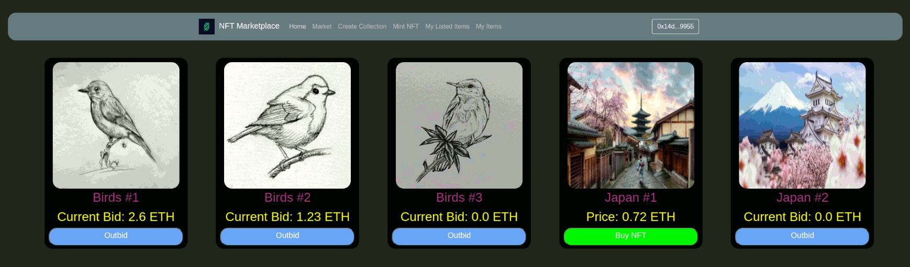
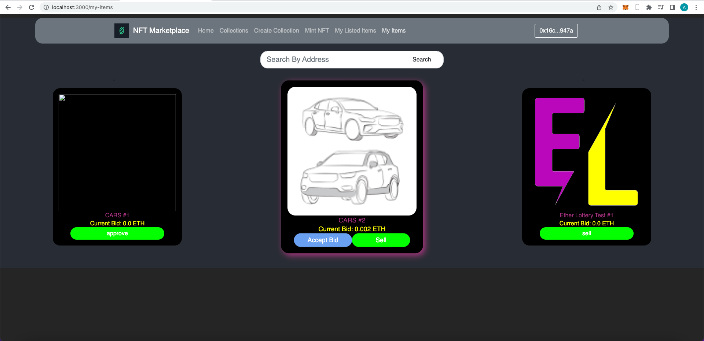

# NFT Marketplace

The main object of this project is to have a highly (gas) efficient and secure set of contracts with a simple frontend for interaction with them. This is done by using Clones and some other patterns to reduce gas costs, while maintaining the security level high. 

# Features

1) Each collection has it's own smart contract (Like OpenSea).
2) Clear smart contracts with optimised storage use.
3) Bids.

# To-Do List:
1) Clear Frontend visual issues (Messages, component styling, etc).
2) Auctions.

# Setup

Register at infura.com and obtain a pair of api keys for the ipfs provider. The keys then should be saved in the infura.json file in the src directory.

1. Install packages
```bash
npm install (in case of error, rerun with the parameter --legacy-peer-deps)
```
2. Run the frontend.
```bash
npm start
```

The front end is currently working with contracts minted on goerli test network. If you wish to run them on a local blockchain, follow the steps:

1. Run the blockchain.
```bash
npx hardhat node
```
2. Deploy the contracts.
```bash
npx hardhat run --network localhost scripts/deploy.js
```
3. Connect your Metamask wallet to the blockchain.

# Videos

1) Simple marketplace tour.
https://youtu.be/7V0RmTl4Snc

# Screenshots

1) Main Menu


2) My-own Items Menu:


3) Tests:
