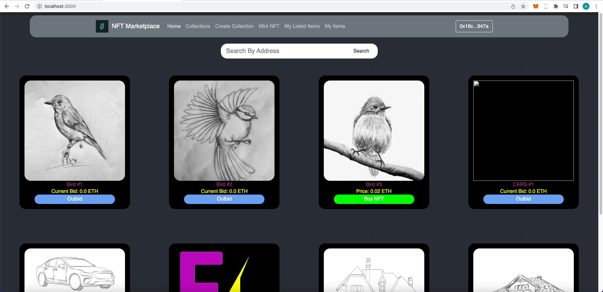

# NFT Marketplace - In progress

The main object of this project is to have a highly (gas) efficient set of contracts with most of the job done in the front end.

# Features

1) Each collection has it's own smart contract (Like OpenSea).
2) Clear smart contracts with optimized storage use.
3) Bids.

# To-Do List:
1) Clear Frontend visual issues (Messages, component styling, etc).
2) Add more functionalities when minting new collections (NFT Count limits, Choose between IPFS/Onchain hosted images, etc).
3) Auctions.

# Setup
1. Install packages
```bash
npm install
npm install react-bootstrap
npm install @openzeppelin/contracts
```
2. Run the node
```bash
npx hardhat node
```
3. Perform tests.
```bash
npx hardhat test
```
4. Deploy contracts and run react.
```bash
npx hardhat run --network localhost scripts/deploy.js
npm start
```

# Screenshots

1) Main Menu


2) My-own Items Menu:

