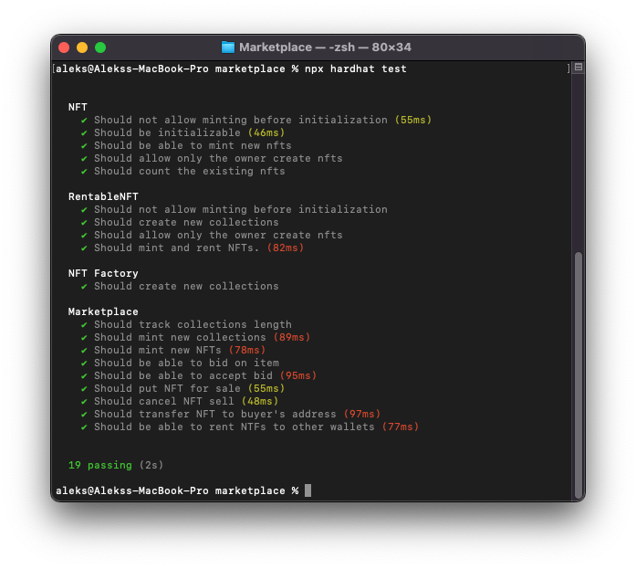

# NFT Marketplace - Typescript Rework

This is a rework of the initial marketplace project, that aims to bring better readability and maintainability to the code. I've decided to use Typescript this time, while implementing all the rest React best practices. 

# Features

1) Each collection has it's own smart contract (Like OpenSea).
2) Clear smart contracts with optimised storage use.
3) Bids.

# To-Do List:
1) Implement Rentable NFTs features.

# Setup

Register at infura.com and make a new application api. Rename ```sample-infura.json``` to ```infura.json``` and set the reqired keys accordingly. 

1. Install packages
```bash
yarn
```
2. Run the App
```bash
yarn start
```

# Videos

1) Simple marketplace tour.
https://youtu.be/7V0RmTl4Snc

# Screenshots

1) Main Menu


2) My-own Items Menu:


# Tests

